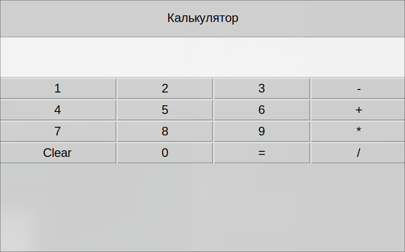

# Лабораторная работа №9

## Tkinter

**Tkinter** — это стандартный графический интерфейс (GUI) для языка программирования Python. Он предоставляет набор инструментов для создания оконных приложений с различными элементами управления, такими как кнопки, текстовые поля, выпадающие списки, метки, и многое другое.

### Импортирование tkinter

```python
import tkinter as tk
```

_Импортируем библиотеку `tkinter` как переменную `tk`_

### Использование TKinter

1. Создание интерфейса

Для того, чтобы создать интерфейс Tkinter необходимо конструктор поместить в переменную

```python
root = tk.Tk()
```

-   `root` - переменная с интерфейсом
-   `tk.Tk()` - конструктор библиотеки Tkinter

2. Запуск интерфейса

```python
root.mainloop()
```

_Можете запустить программу, чтобы увидеть интерфейс_

3. Изменение свойств окна

Добавьте строку

```python
root.geometry("800x500")
```

Перед началом программы `read.mainloop()`

-   `geometry` - установка размера окна
-   `800` - по ширине
-   `500` - по высоте

Также добавьте название окна

```python
root.title("Моя программа")
```

#### Основные элементы Tkinter

1. Планировка интерфейса TKinter

    1. Добавляем надпись

```python
label = tk.Label(root, text="Hello world!", font=("Arial", 18))
```

-   `tk.Label` - создание надписи в интерфейсе
-   параметр `root` - передаем переменную нашего окна интерфейса, где будет находиться надпись
-   параметр `text` - что будет написано
-   параметр `font` - типа tuple, где первый аргумент - название шрифта, а второй - размер в пикселях

    2. Добавляем отступ

```python
label.pack(padx=20, pady=20)
```

-   `label.pack()` - говорит о том, что мы используем `pack` тип планировки и помещяем надпись на экран
-   `padx` - отступ слева и справа
-   `pady` - отступ сверху и снизу

> [!NOTE]
>
> `pack` работает как
>
> ```css
> display: flex;
> flex-direction: column;
> ```

2. Добавление текстового поля

```python
textbox = tk.Text(root, height=3, font=("Arial", 16))
```

_также есть еще `tk.Entry`, который создает текстовое окно в одну строчку_

> [!WARNING]
>
> **Задание 1**
>
> Поместите текстовое поле на экран

#### Использование grid системы

1. Создание рамки, чтобы внутри неё организовывать интерфейс по `grid`, а не `pack`

```python
buttonFrame = tk.Frame(root)
```

2. Создание колонок
   Одна колонка создается с помощью команды

```python
buttonFrame.columnconfigure(0, weight=1)
buttonFrame.columnconfigure(1, weight=1)
```

-   `0` - номер колонки
-   `weight=1` - размер колонки по соотношению к другим колонкам (работает как `fr` из CSS грида)

_То есть мы создали 2 колонки, где эти колонки равны_

3. Создание кнопки

```
btn1 = tk.Button(buttonFrame, text="1", font=("Arial", 18))
```

-   `buttonFrame` - значит, что кнопка будет внутри нашей рамки с grid системой
-   `text` - что написано на кнопке

4. Размещение кнопки

Указываем на каком месте в нашей grid система кнопка будет находиться

```python
btn1.grid(row=0, column=0, sticky="we")
```

-   `row` - строка
-   `column` - колонка
-   `we` - West + East, то есть растягиваем кнопку по ширине (с запада на восток)

5. Разместить фрейм с кнопками

```python
buttonFrame.pack(fill="x")
```

-   `fill="x"` - значит растянуть `buttonFrame` по оси x

_Так как buttonFrame находится внутри `pack` дисплея, то нужно его разместить внутри него через метод `pack()`_

> [!WARNING]
>
> **Задание 2**
>
> Приведите калькулятор к следующему виду


